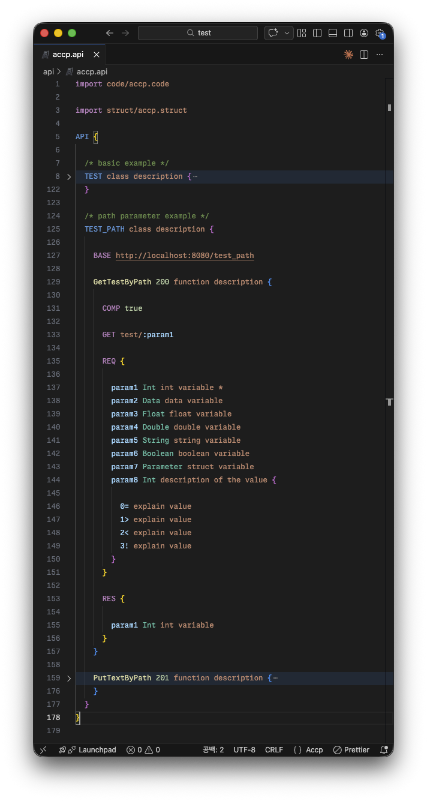
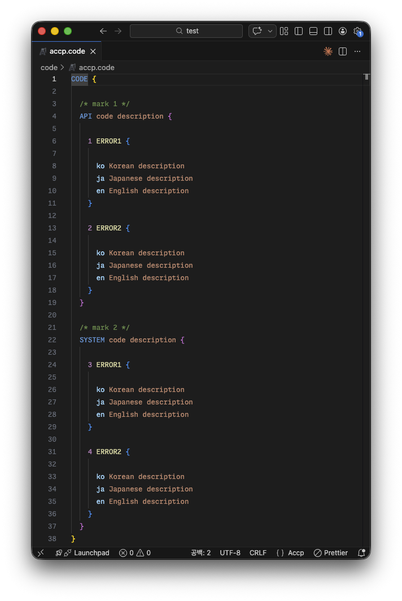
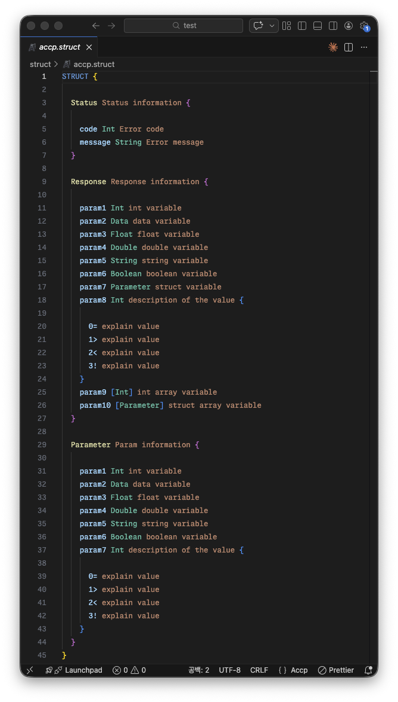
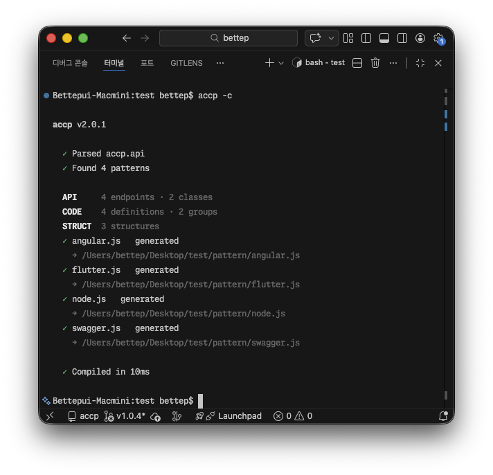

# accp

**Auto Create Code with Pattern files.**

[](https://www.npmjs.com/package/accp)
[](LICENSE)

Define your API in `.api` files, then generate any language — TypeScript, Flutter, Swagger, and more — through customizable pattern files. Includes an MCP server for LLM integration.

```
.api / .code / .struct  →  accp --compile  →  pattern/*.js  →  Generated code
```

## Installation

```bash
npm install accp -g
```

## Quick Start

```bash
# 1. Create example project
accp --examples my-project

# 2. Compile
cd my-project && accp --compile
```

## Project Structure

| Folder    | Extension  | Description                      |
| --------- | ---------- | -------------------------------- |
| `api/`    | `.api`     | API endpoint definitions         |
| `code/`   | `.code`    | Error codes and translations     |
| `struct/` | `.struct`  | Data structures used in API      |
| `pattern/`| `.js`      | Code generation templates        |

All folders are required.

## Syntax

### .api — API Endpoints



### .code — Error Codes



### .struct — Data Structures



### Compile



## CLI

| Command              | Description                    |
| -------------------- | ------------------------------ |
| `accp --compile`     | Compile and generate code      |
| `accp --examples <dir>` | Create example project      |

## Pattern Files

Pattern files receive `OBJ` (compiled data) and `GEN` (file writer) as arguments:

```javascript
module.exports = function (OBJ, GEN) {
  const file = new GEN("output/api.ts");
  file.open();
  file.print("// generated code\n");
  file.close();
};
```

### GEN Methods

| Method              | Description                          |
| ------------------- | ------------------------------------ |
| `new GEN(path)`     | Create instance (auto-creates dirs)  |
| `.open(encoding?)`  | Start writing (default: `utf8`)      |
| `.print(string)`    | Append content                       |
| `.close()`          | Flush buffer to file                 |

### OBJ Structure

```javascript
OBJ = {
  API: [{
    BASE: String,          // base path
    NAME: String,          // class name
    MARK: String,          // description
    FUNC: [{
      CODE: Int,           // endpoint code
      NAME: String,        // function name
      DESC: String,        // description
      (GET|PUT|POST|PATCH|DELETE): String,  // method: path
      PARAM: [String],     // path parameters
      COMP: Boolean,       // completion status
      PROC: [{ CODE, NAME }],              // related endpoints
      MARK: [{ NAME, MARK }],              // comments
      REQ: [{ NAME, MARK, CLASS, ARRAY, OPTION }],  // request fields
      RES: [{ ... }],      // response fields (same as REQ)
      OPT: { key: Boolean } // user-defined options
    }]
  }],

  CODE: [{
    NAME: String,
    MARK: String,
    CODE: [{ CODE: Int, NAME: String, MARK: { lang: String } }]
  }],

  STRUCT: [{
    NAME: String,
    MARK: String,
    DATA: [{ ... }]        // same as REQ fields
  }]
}
```

## MCP Server

accp includes an MCP server (`accp-mcp`) for integration with LLM tools like Claude Code.

### Setup

Add to your Claude Code settings (`~/.claude/settings.json`):

```json
{
  "mcpServers": {
    "accp": {
      "command": "accp-mcp"
    }
  }
}
```

### Available Tools

| Tool                | Description                                    |
| ------------------- | ---------------------------------------------- |
| `accp_compile`      | Parse `.api`/`.code`/`.struct` into JSON (OBJ) |
| `accp_generate`     | Compile and run pattern files to generate code  |
| `accp_validate`     | Check syntax without generating                |
| `accp_list_patterns`| List available pattern files                   |
| `accp_read_file`    | Read an accp source file                       |
| `accp_write_file`   | Write an accp source file                      |
| `accp_parse_string` | Parse accp syntax from a string                |

## VS Code Extension

[accp language support](https://marketplace.visualstudio.com/items?itemName=Bettep.accp) — syntax highlighting and snippets for `.api`, `.code`, `.struct` files.

Snippets: `API`, `CODE`, `STRUCT`

## Built-in Types

`Int` `Float` `Double` `String` `Boolean` `Data`

## Programmatic Usage

```javascript
const accp = require('accp');
```

The `core.js` module exposes the compiler for use in Node.js applications.

## License

[MIT](LICENSE)
